# goit-rdb-hw-04

ДЗ з РБД: DML та DDL команди, JOIN у MySQL

## Завдання №1
Створення схеми LibraryManagement і таблиць [p1_create_tables.sql](sql/p1_create_tables.sql)

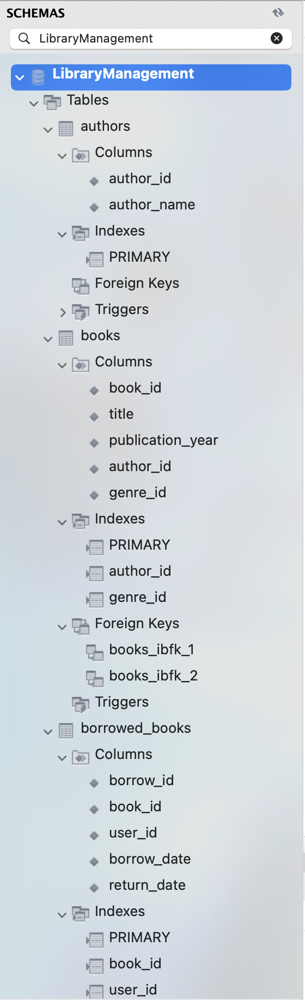
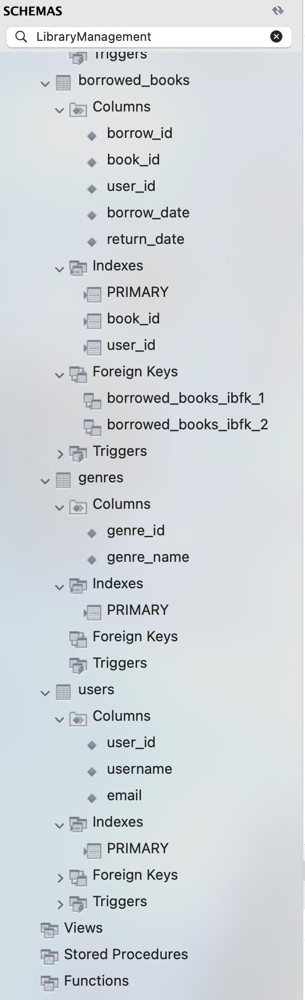

## Завдання №2
Заповнення таблиць власними тестовими даними [p2_insert_values.sql](sql/p2_insert_values.sql)

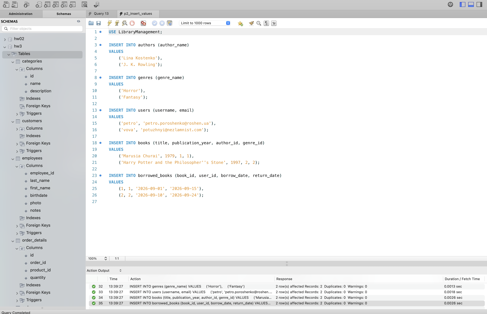

## Завдання №3
Об'єднання всіх таблиць через INNER JOIN [p3_join.sql](sql/p3_join.sql)

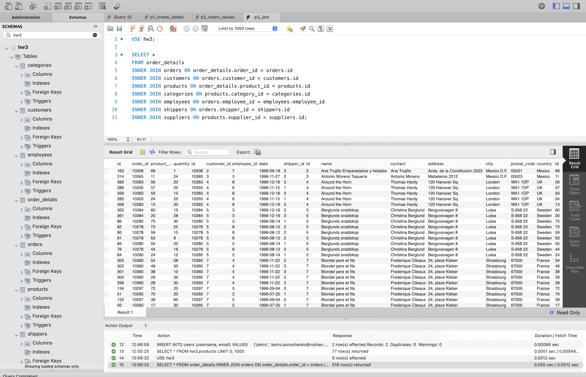

## Завдання №4

### 4.1 Кількість рядків (COUNT)
[p4_1_count.sql](sql/p4_1_count.sql) 
result = 518 rows

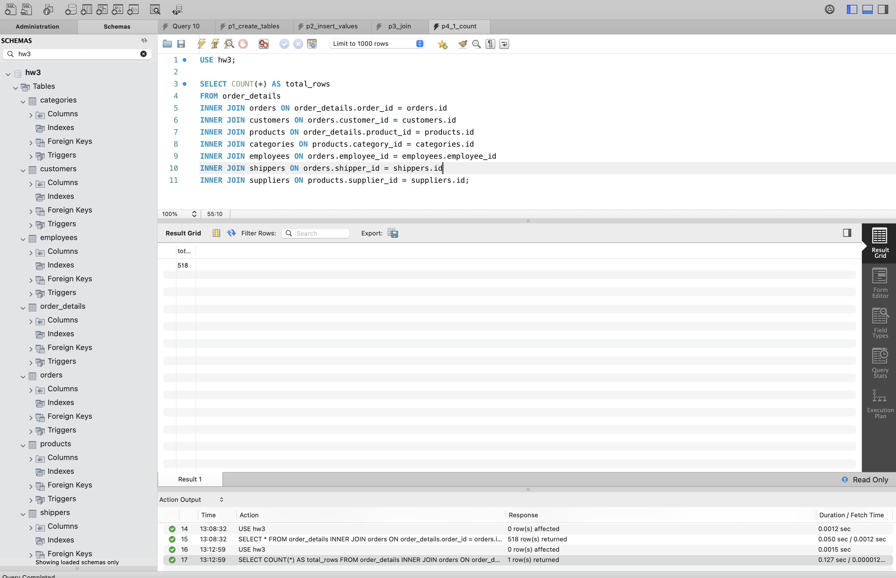

### 4.2 INNER на LEFT JOIN
[p4_2_count.sql](sql/p4_2_count.sql)

INNER JOIN employees і INNER JOIN suppliers змінено на LEFT JOIN. Результат (result = 518 rows) не змінився.

**Пояснення до отриманого результату**: кількість не змінилася, тому що кожен order має employee, а кожен product наявного supplier, відповідно безпарних рядків нема.
INNER JOIN нічого не відкидав, тому для LEFT JOIN і нема чого додати. Кількість могла б зрости, якщо б в лівій таблиці були записи без пари справа.

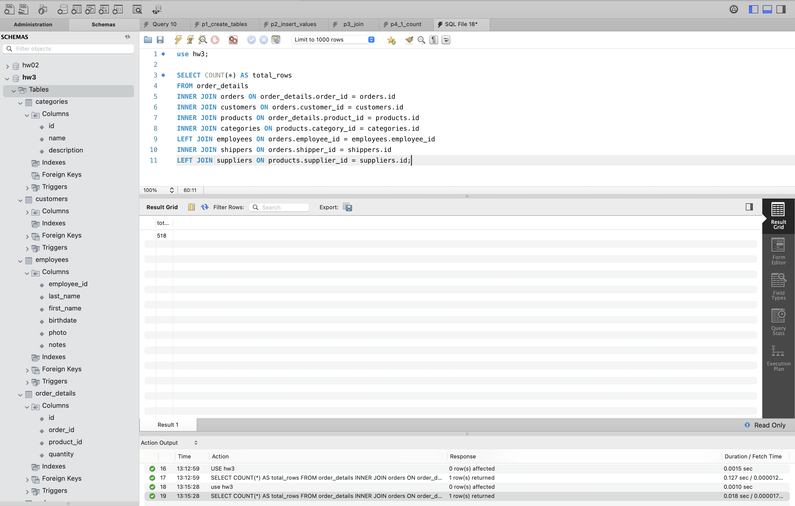

### 4.3 employee_id > 3 та ≤ 10
[p4_3_select_3_10.sql](sql/p4_3_select_3_10.sql)

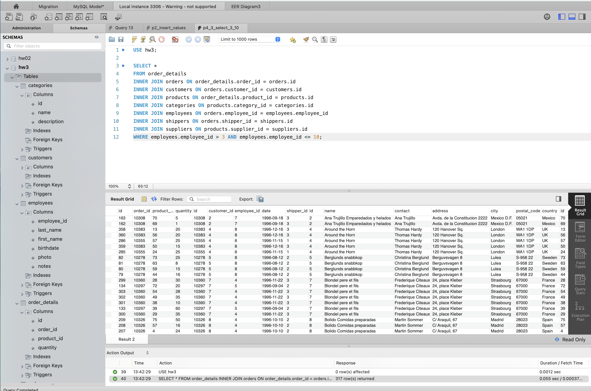

### 4.4 GROUP BY за категорією, COUNT та AVG(quantity)
[p4_4_groupBy.sql](sql/p4_4_groupBy.sql)

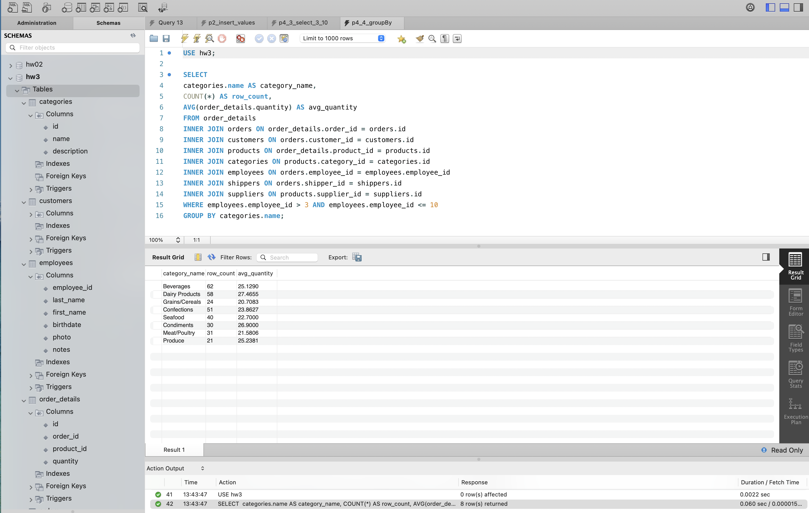

### 4.5 HAVING середня кількість > 21
[p4_5_havingAvgQuantity_21.sql](sql/p4_5_havingAvgQuantity_21.sql)

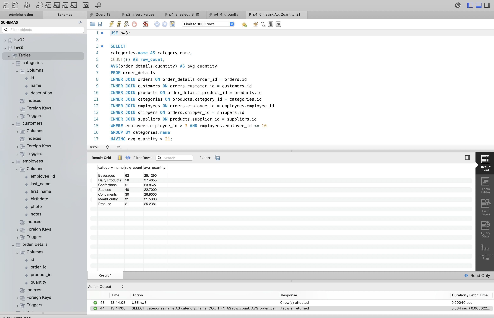

### 4.6 ORDER BY кількість рядків за спаданням
[p4_6_orderBy.sql](sql/p4_6_orderBy.sql)

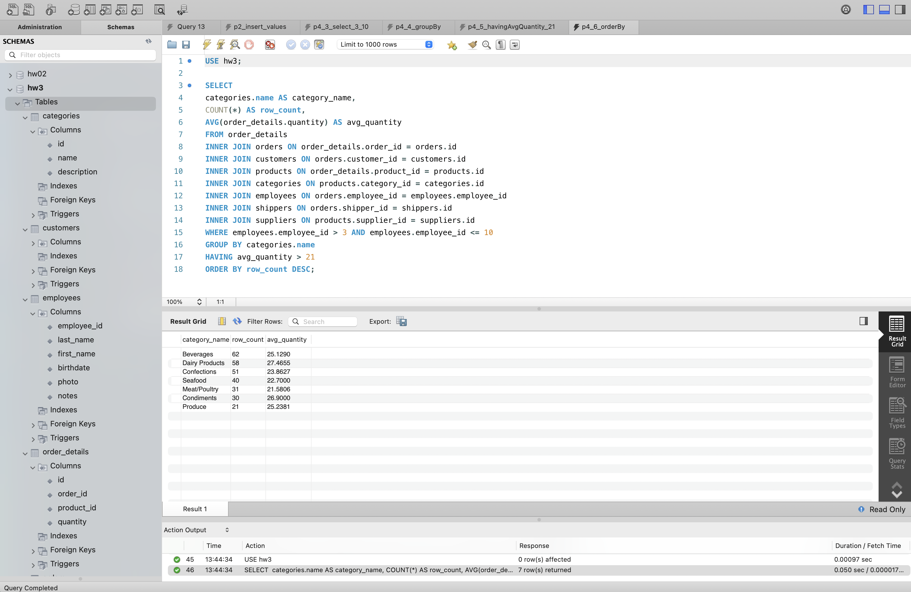

### 4.7 LIMIT 4 OFFSET 1
[p4_7_limit_offset.sql](sql/p4_7_limit_offset.sql)

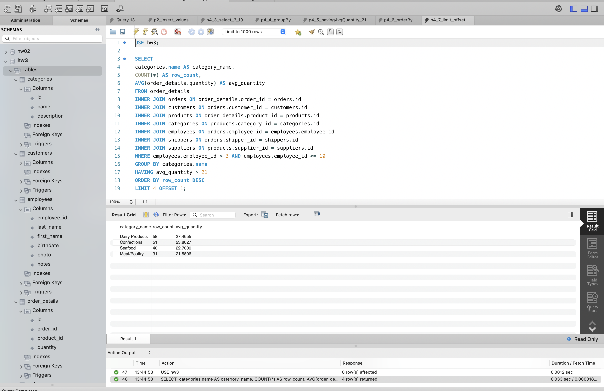
